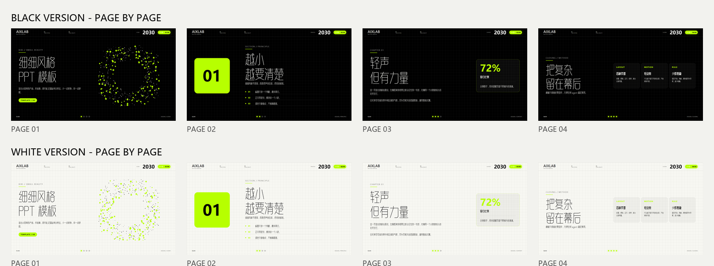
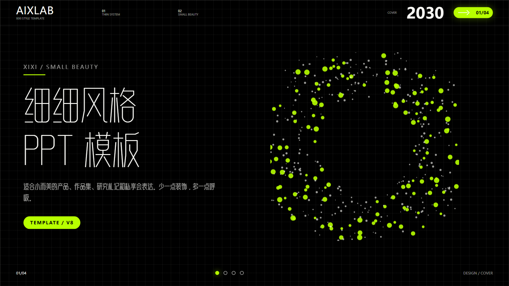
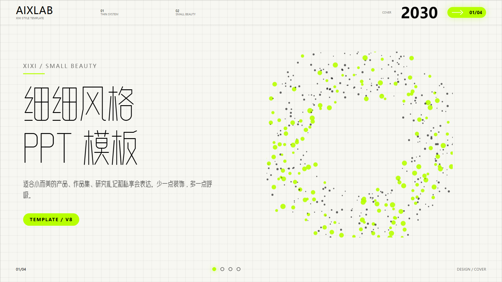

# BWC XIXI PPT HTML

**BWC xixi ppt html** is a Codex skill for generating small-and-beautiful HTML presentations in the BaiWuchang visual style, then exporting an editable PowerPoint file from the generated HTML.

## 中文介绍

**BWC xixi ppt html** 是一套用于生成“细细风格”网页 PPT 的 Codex Skill。它内置黑色版和白色版两套模板，适合小而美产品介绍、作品集展示、研究札记、私享会分享和轻量发布稿。

这套模板已经打包白无常原创字体 **白无常可可体**。该字体可免费商用，HTML 模板会直接加载内置字体；导出 PPTX 时，脚本也会自动安装字体，并让 PPT 里的可编辑文字统一使用白无常可可体。

本项目支持两种输出：一种是可本地打开、支持键盘翻页的 HTML 演示文稿；另一种是由 HTML 生成的 PowerPoint 文件。PPTX 不是整页截图，标题、正文、页码和标签都保留为可编辑文字，方便二次修改。



## What It Makes

- A local, keyboard-navigable HTML slide deck.
- An editable `.pptx` generated from the HTML.
- Two built-in visual versions:
  - **Black version**: clean black grid, neon green accent.
  - **White version**: soft white grid, neon green accent.

| Black | White |
| --- | --- |
|  |  |

## Font

This package includes **白无常可可体** / **BaiWuchangKeke**, an original font by BaiWuchang.

- The font is bundled inside `assets/fonts/`.
- It can be used commercially for free.
- HTML templates load the bundled font directly.
- The PPTX export script installs the bundled font on Windows when needed.
- Exported PowerPoint files specify **白无常可可体** for editable text.

Bundled font files:

- `assets/fonts/BaiWuchangKeke-Thin.ttf`
- `assets/fonts/BaiWuchangKeke-Regular.ttf`
- `assets/fonts/BaiWuchangKeke-Bold.ttf`

## Why This Is Useful

Many HTML-to-PPT workflows export slide screenshots. This skill is different:

- The HTML version is suitable for browser-based presentation.
- The generated PPTX keeps text as editable PowerPoint text boxes.
- The PPTX is not a full-slide screenshot.
- You can open the PPTX and directly edit titles, body text, page labels, and numbers.

## Included Files

```text
BWC-XIXI-PPT-HTML/
  SKILL.md
  assets/
    fonts/
      BaiWuchangKeke-Thin.ttf
      BaiWuchangKeke-Regular.ttf
      BaiWuchangKeke-Bold.ttf
    templates/
      xixi-template-black.html
      xixi-template-white.html
    preview/
      all-8-pages-summary.png
      black-cover.png
      white-cover.png
  scripts/
    html_to_editable_pptx.py
    install_bwc_fonts.ps1
```

## Usage

Copy one template and edit the slide content:

```text
assets/templates/xixi-template-black.html
assets/templates/xixi-template-white.html
```

Then export an editable PPTX:

```bash
python scripts/html_to_editable_pptx.py path/to/deck.html path/to/deck.pptx
```

On Windows, you can manually install the bundled font first:

```powershell
powershell -ExecutionPolicy Bypass -File scripts/install_bwc_fonts.ps1
```

The Python export script also tries to install the bundled font automatically on Windows.

## Style

The deck style is:

- Chinese-first.
- Minimal and fine-lined.
- Black/white grid background.
- Neon green as the single accent color.
- Animated particle-ring cover in HTML.
- BaiWuchangKeke typography across HTML and PPTX.

Use it for product decks, personal talks, research notes, portfolio presentations, and refined small-scale launches.
